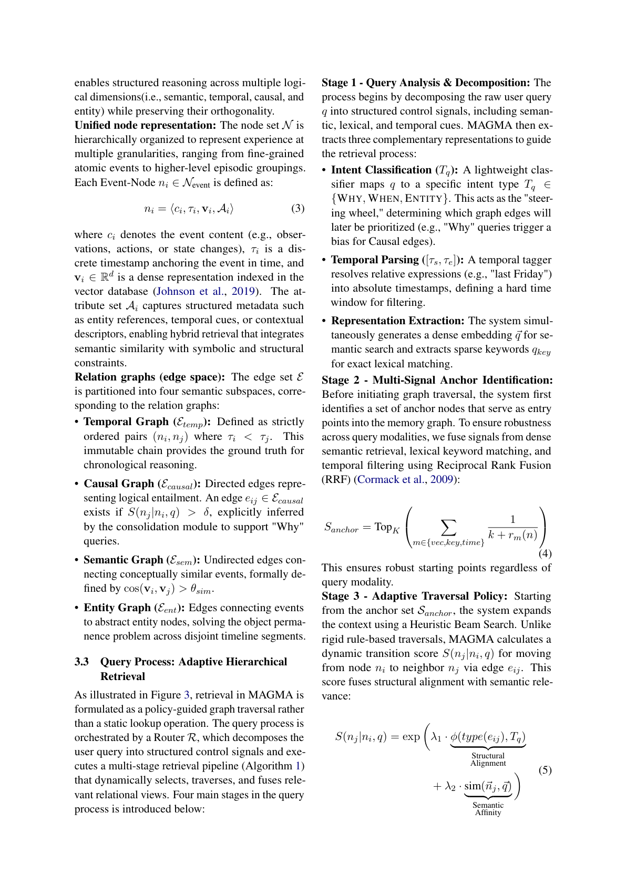

<p align="center">
  
</p>

<p align="center">
  <a href="https://github.com/yeerlang/magma-obsidian-memory/blob/master/LICENSE"></a>
  <a href="https://www.python.org/downloads/"></a>
  <a href="https://arxiv.org/abs/2601.03236"></a>
  <a href="README.md"></a>
  <a href="https://github.com/yeerlang/magma-obsidian-memory"></a>
  <a href="https://modelcontextprotocol.io"></a>
</p>

# MAGMA × Obsidian Memory

> Your agent forgets everything between sessions. Fix that.

[中文文档](README.md) | [Paper](docs/paper/architecture.md) | [API](docs/api.md)

**MAGMA gives your AI agent a persistent, four-dimensional memory that actually works.** MAGMA stands for **M**ulti-**G**raph based **A**gentic **M**emory **A**rchitecture — unlike flat vector search that throws chunks at every query, MAGMA stores experience across four interconnected graphs — temporal, causal, semantic, and entity — then retrieves by *traversing relationships*, not just matching embeddings. The result: your agent remembers context, traces cause and effect, and builds a knowledge graph you can actually inspect and correct.

Pair it with Obsidian and you get a human-auditable memory dashboard — every inferred edge can be reviewed, confirmed, or rejected. Powered by the [MAGMA paper](https://arxiv.org/abs/2601.03236) (arXiv 2601.03236), implemented as a single `docker compose up` + MCP server that plugs into Hermes, Claude, Cursor, Cline, Windsurf, Continue, and anything else that speaks MCP.

|**Your agent. Your data. Your rules.** Embeddings stay local. LLM calls only when you configure them. No lock-in, no black box.

## What Makes MAGMA Different

| | Plain RAG | LangChain Memory | Mem0 | **MAGMA** |
|---|---|---|---|---|
| **Storage** | Flat chunks | Key-value store | Flat events | **4 relational graphs** |
| **Retrieval** | cos(v_q, v_doc) | Last N messages | cos similarity | **RRF fusion + beam search** |
| **Relations** | None | Chronological only | None | **Temporal/Causal/Semantic/Entity** |
| **Consolidation** | None | None | None | **LLM slow path infers structure** |
| **Human review** | None | None | None | **Obsidian vault for audit** |
| **MCP native** | ❌ | ❌ | ❌ | **✅ stdio server** |

## Architecture

MAGMA is based on [arXiv 2601.03236](https://arxiv.org/abs/2601.03236) — a multi-graph agentic memory architecture that diverges from vector-only RAG:

<p align="center">
  
</p>

> **Three-Layer Design**: Query Process (top) — intent classification → RRF fusion → beam search → linearization. **Data Structure** (middle) — GraphDB stores four edge types (Temporal/Causal/Semantic/Entity), VectorDB indexes embeddings. **Memory Evolution** (bottom) — Fast Path writes events instantly; Slow Path uses LLM to infer causal and entity structure in background.

### 4-Stage Query Pipeline

<p align="center">
  
</p>

> **(1) Intent** detects WHY/WHEN/WHAT/ENTITY → **(2) RRF** merges vector + keyword + time signals → **(3) Beam Search** traverses with intent-weighted edge priorities → **(4) Linearization** topologically sorts with token budgeting.

## Why MAGMA?

**"Won't hallucinations compound?"** — Every edge is tagged with provenance. The Obsidian integration lets you review and correct LLM-inferred relations before they become permanent. Causal edges go through a human-confirmation review queue.

**"Does it scale past 1000 events?"** — Beam search with budget control (`budget=30`) keeps retrieval bounded regardless of graph size. RRF fusion ensures signal quality doesn't degrade as the graph grows.

**"Do I need an API key?"** — Fast Path (write + query) works completely offline with local embeddings. Only the Slow Path (causal/entity inference) needs an LLM. Use any OpenAI-compatible endpoint.

**"Is this just another vector database?"** — No. Vector search is only one of three RRF signals (alongside keyword match and time filtering). The graph traversal step (Beam Search with intent-weighted edges) is what makes retrieval relational rather than flat.

## Quick Start

```bash
git clone https://github.com/yeerlang/magma-obsidian-memory.git
cd magma-obsidian-memory
cp .env.example .env
# Edit .env with your LLM API key

docker compose up
# API: http://localhost:8765
# Health: http://localhost:8765/health
```

### Without Docker

```bash
pip install -r requirements.txt
python -m uvicorn app:app --host 0.0.0.0 --port 8765
```

### Test it

```bash
python test_api.py
# 8 tests: health → write events → query → semantic edges → stats → save
```

## Connect Your Agent

MAGMA speaks standard MCP stdio protocol — works with any MCP-compatible agent.

### Hermes Agent

Add to `~/.hermes/config.yaml`:

```yaml
mcp_servers:
  magma:
    command: "python"
    args: ["/path/to/magma-obsidian-memory/mcp_magma_server.py"]
    timeout: 60
```

`hermes mcp reload` — tools appear as `magma_add_event`, `magma_query`, etc.

### Claude Desktop / Claude Code

`~/.config/claude/claude_desktop_config.json`:

```json
{"mcpServers": {"magma": {"command": "python", "args": ["/path/to/magma-obsidian-memory/mcp_magma_server.py"]}}}
```

### Cursor

`.cursor/mcp.json` in project root:

```json
{"mcpServers": {"magma": {"command": "python", "args": ["/path/to/magma-obsidian-memory/mcp_magma_server.py"]}}}
```

### Cline (VS Code)

Cline settings → MCP Servers → Add:

```json
{"mcpServers": {"magma": {"command": "python", "args": ["/path/to/magma-obsidian-memory/mcp_magma_server.py"], "disabled": false, "alwaysAllow": ["magma_add_event", "magma_query", "magma_stats"]}}}
```

### Windsurf

`.windsurf/mcp.json`:

```json
{"mcpServers": {"magma": {"command": "python", "args": ["/path/to/magma-obsidian-memory/mcp_magma_server.py"]}}}
```

### Continue (VS Code / JetBrains)

`~/.continue/config.json`:

```json
{"experimental": {"mcpServers": {"magma": {"command": "python", "args": ["/path/to/magma-obsidian-memory/mcp_magma_server.py"]}}}}
```

### OpenCode / Codex / Aider / Goose

All support MCP stdio. Use the same pattern: `{"command": "python", "args": ["/path/to/mcp_magma_server.py"]}` in their respective MCP config files.

### Any Agent (REST API)

Agents without MCP can use the REST API directly:

```python
import requests
r = requests.post("http://localhost:8765/events", json={"content": "User prefers dark mode"})
r = requests.post("http://localhost:8765/query", json={"query": "dark mode"})
```

Full API reference: [docs/api.md](docs/api.md)

## Obsidian Integration (Optional)

Configure your vault path in `.env`:

```env
OBSIDIAN_VAULT_PATH=/path/to/your/obsidian/vault
```

Four integration scripts:

| Script | Purpose |
|---|---|
| `obsidian-integration/scripts/dashboard.py` | Live MAGMA stats → Obsidian page |
| `obsidian-integration/scripts/ingest.py` | Wiki pages → MAGMA entity nodes |
| `obsidian-integration/scripts/review.py` | LLM-inferred edges → human review notes |
| `obsidian-integration/scripts/export.py` | MAGMA graph → Obsidian wikilinks + Graph View |

See [obsidian-integration/HOWTO.md](obsidian-integration/HOWTO.md) for setup.

## Privacy & Data Flow

MAGMA processes your data locally by default:

- **Embeddings**: Generated locally via `sentence-transformers` (all-MiniLM-L6-v2). Never sent to external APIs.
- **Graph storage**: In-memory (GraphDB + VectorDB). Persist to JSON with `POST /save`.
- **LLM calls**: Only the Slow Path (causal/entity inference) calls your configured LLM. Fast Path and queries are fully local.
- **API keys**: Stored in local `.env`. Never logged or transmitted.
- **Obsidian vault**: Read-only from configured `OBSIDIAN_VAULT_PATH`. Writes only to `magma/` subdirectory.

When no LLM is configured, MAGMA runs entirely offline — write events, search vectors, traverse the graph, all local.

## Paper Documentation

MAGMA's implementation is mapped line-by-line to the original paper:

| Document | Content |
|---|---|
| **[architecture.md](docs/paper/architecture.md)** | System architecture with annotated diagrams |
| **[formula-mapping.md](docs/paper/formula-mapping.md)** | Every formula → code location |
| **[algorithms.md](docs/paper/algorithms.md)** | All 3 algorithms with Chinese annotations |
| **[paper.pdf](docs/paper/paper.pdf)** | Full paper (arXiv 2601.03236) |

## API Endpoints

| Method | Path | Purpose |
|---|---|---|
| `GET` | `/health` | Health check |
| `POST` | `/events` | Write event (Fast Path) |
| `POST` | `/events/segmented` | Auto-segment long text → batch write |
| `GET` | `/events` | List events (paginated) |
| `GET` | `/events/{id}` | Get single event |
| `POST` | `/events/{id}/infer` | Trigger Slow Path inference |
| `POST` | `/query` | 4-stage query |
| `POST` | `/events/semantic-edges` | Build semantic similarity edges |
| `GET` | `/stats` | Engine statistics |
| `POST` | `/save` | Persist to JSON |
| `POST` | `/load` | Load from JSON |

## MCP Tools

| Tool | Description |
|---|---|
| `magma_add_event` | Write an event to memory |
| `magma_query` | 4-stage retrieval query |
| `magma_stats` | Memory statistics |
| `magma_build_semantic_edges` | Build semantic similarity edges |
| `magma_get_recent` | Get recent events |

## Configuration

All configuration via `.env`:

| Variable | Required | Default | Description |
|---|---|---|---|
| `LLM_API_KEY` | For Slow Path | — | Your LLM API key (OpenAI-compatible) |
| `LLM_BASE_URL` | No | `https://api.deepseek.com` | LLM API base URL |
| `LLM_MODEL` | No | `deepseek-chat` | Model name |
| `OBSIDIAN_VAULT_PATH` | No | — | Path to Obsidian vault |
| `HF_HUB_OFFLINE` | No | `0` | Set to `1` if HF is unreachable |

## Contributing

```bash
git clone https://github.com/yeerlang/magma-obsidian-memory.git
cd magma-obsidian-memory
pip install -r requirements.txt

# Run tests
python test_api.py

# Start dev server
python -m uvicorn app:app --host 0.0.0.0 --port 8765 --reload
```

PRs welcome. See [issues](https://github.com/yeerlang/magma-obsidian-memory/issues) for open tasks.

## Project Structure

```
magma-obsidian-memory/
├── README.md / README.md
├── .env.example / .gitignore / LICENSE
├── docker-compose.yml / Dockerfile
├── requirements.txt
├── assets/                   # Banner + branding
├── app.py                    # FastAPI (:8765)
├── mcp_magma_server.py       # MCP stdio server
├── test_api.py               # Integration tests
├── memory/                   # Core engine
│   ├── graph_db.py           # 4-graph storage
│   ├── vector_db.py          # Vector index
│   ├── trg_memory.py         # Fast/Slow path engine
│   └── query_engine.py       # 4-stage retrieval
├── docs/
│   ├── api.md / setup.md
│   └── paper/                # Paper docs + figures
├── obsidian-integration/     # Obsidian bridge
└── integrations/hermes/      # Hermes MCP config
```

## Star History

[](https://star-history.com/#yeerlang/magma-obsidian-memory&Date)

## License

MIT — see [LICENSE](LICENSE).
