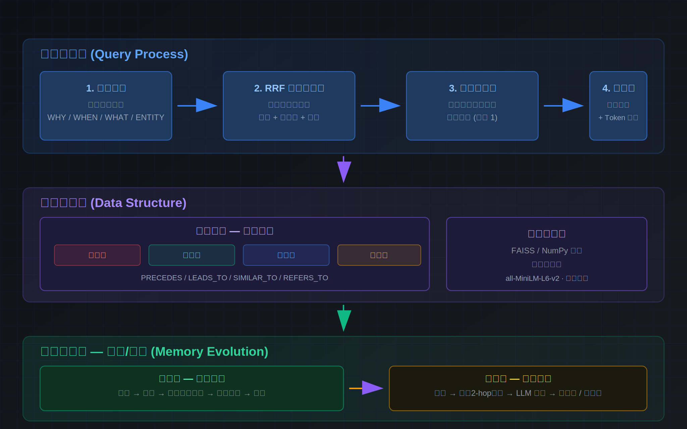
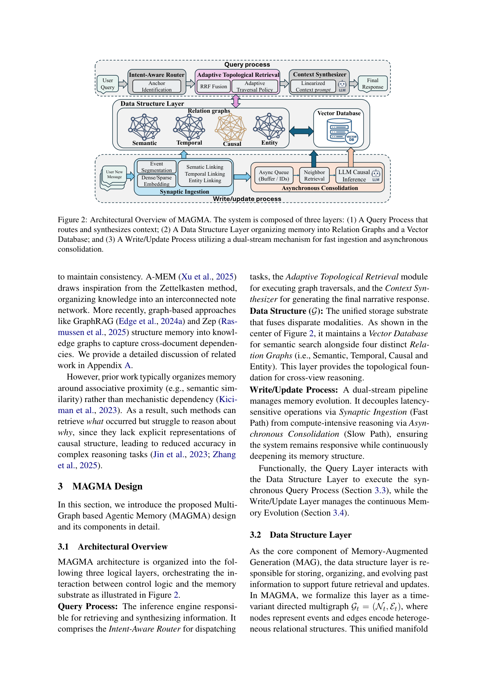

<p align="center">
  
</p>

<p align="center">
  <a href="https://github.com/yeerlang/magma-obsidian-memory/blob/master/LICENSE"></a>
  <a href="https://www.python.org/downloads/"></a>
  <a href="https://arxiv.org/abs/2601.03236"></a>
  <a href="README.en.md"></a>
  <a href="https://github.com/yeerlang/magma-obsidian-memory"></a>
  <a href="https://modelcontextprotocol.io"></a>
  <a href="#-生产验证-2026-07-01"></a>
  <a href="docs/migration.md"></a>
</p>

# MAGMA × Obsidian 记忆引擎

> 你的 Agent 每次会话结束就失忆。修好它。

[English](README.en.md) | [论文文档](docs/paper/architecture.md) | [API](docs/api.md) | [升级指南](docs/migration.md)

**MAGMA 给你的 AI Agent 装上四维记忆，通过 Obsidian 实现人可审计的知识演化。** MAGMA 全称 **M**ulti-**G**raph based **A**gentic **M**emory **A**rchitecture（多图基智能体记忆架构）—— 不是向量搜索那种"把文本块甩给每次查询"的扁平匹配——MAGMA 把经验存进四张互联的关系图（时序、因果、语义、实体），检索时走的是*关系遍历*而非向量相似度。

**Obsidian 是 MAGMA 的人机协作界面。** LLM 慢路径推断的每条因果边、实体关系都会进入 Obsidian 审查队列——你可以逐条确认、修正或驳回。MAGMA 图谱可导出为 Obsidian Graph View 可视化，Wiki 页面与实体节点双向同步。Agent 的记忆不再是不透明的黑箱，而是你可以随时翻阅、编辑的知识库。

基于 [MAGMA 论文](https://arxiv.org/abs/2601.03236) (arXiv 2601.03236)，一条 `docker compose up` 启动，MCP 协议直连 Hermes、Claude、Cursor、Cline、Windsurf、Continue 等所有主流 Agent。

**你的 Agent，你的数据，你的规则。** 嵌入向量本地生成，LLM 调用按需配置，无锁定，无黑箱。

## 升级指南

**从旧版本 (pre-2026-07-01) 升级？** → **[docs/migration.md](docs/migration.md)**

5 步完成：`git pull` → 清理存量边 → 重启 → 验证 → 注册定时任务。旧版已知问题（VectorDB 重启丢失、边爆炸、实体边盲连、慢路径无过滤）全部修复。

## MAGMA 的差异优势

| | 纯 RAG | LangChain Memory | Mem0 | **MAGMA** |
|---|---|---|---|---|
| **存储** | 扁平文本块 | 键值存储 | 扁平事件 | **四张关系图** |
| **检索** | cos(v_q, v_doc) | 最近 N 条消息 | cos 相似度 | **RRF 多信号融合 + 图遍历** |
| **关系** | 无 | 仅时序 | 无 | **时序/因果/语义/实体** |
| **整合** | 无 | 无 | 无 | **LLM 慢路径推断结构** |
| **人审** | 无 | 无 | 无 | **Obsidian 审查/编辑** |
| **MCP 原生** | ❌ | ❌ | ❌ | **✅ stdio 服务** |

## 生产验证 (2026-07-01)

MAGMA 已在 Hermes AI Agent 生产环境中完成 C路线 部署——主攻记忆引擎 + 纯文本保底。8 个模块全部完成，3 轮独立审计（Codex/Claude/Hermes），所有修复从 MAGMA 论文第一性原则出发。

```
修复前: 52节点, 0向量, 5950边(114x), 0摄入管道, 8次测试查询
修复后: 52节点, 36向量, 410边(7.9x), 7 cron守护, 12次生产查询
```

| 模块 | 论文依据 | 成果 |
|------|---------|------|
| M1 持久化修复 | Section 3.2 双存储架构 | VectorDB 重启后完整恢复 |
| M2 边治理 | Algorithm 1 多维平衡 | 5950→410 边, 均衡分布 |
| M2续 质量过滤 | Section 3.4 "high-value edges" | confidence≥70, 边削减62% |
| M3 管道连通 | Section 3.2 知识摄入 | 4脚本端口对齐+环境变量 |
| M7 cron 守护 | 运维完整性 | 7 cron: 告警2+摄入3+蒸馏1+仪表盘1 |
| M8 保底架构 | C路线原则 | memory() 纯文本兜底 |

> **关键教训**：MAGMA 优势来自多图互补而非单图密度。边/节点比从114x降到7.9x后，Beam Search 四维遍历才真正生效。论文 Section 3.4 的 "high-value edges" 不是口号——confidence 过滤让慢路径产出的边削减62%。

## Obsidian 审查工作流

MAGMA 区别于所有纯向量记忆方案的核心：**慢路径推理结果必须经过人工审查才固化入图**，而 Obsidian 是唯一的人机审查界面。

```
事件写入 ──→ 快路径 ──→ 存入图谱（时序/语义边自动创建）
                │
                ▼
          慢路径后台队列
                │
                ▼
         LLM 推断因果/实体关系
                │
                ▼
    ┌── Obsidian 审查队列 ──┐
    │  逐条展示推断结果       │
    │  ✅ 确认 → 固化入图     │
    │  ✏️ 修正 → 重新写入     │
    │  ❌ 驳回 → 丢弃        │
    └──────────────────────┘
                │
                ▼
    Obsidian Graph View 可视化
```

> **为什么必须有 Obsidian？** 没有审查的 AI 记忆 = 幻觉永久化。

## 架构

MAGMA 基于 [arXiv 2601.03236](https://arxiv.org/abs/2601.03236) 论文，是与纯向量 RAG 完全不同的多图记忆架构：

<p align="center">
  
</p>

## 为什么选择 MAGMA？

**"幻觉不会累积吗？"** — 每条边都标注了来源。Obsidian 集成让你在 LLM 推断的关系固化前审查修正。

**"事件超过 1000 条会崩吗？"** — Beam Search 带预算控制（`budget=30`），检索开销不随图规模线性增长。

**"这跟向量数据库有什么区别？"** — 本质不同。向量搜索只是 RRF 三条信号源之一。图遍历才是关键。

## 快速开始

```bash
git clone https://github.com/yeerlang/magma-obsidian-memory.git
cd magma-obsidian-memory
cp .env.example .env
pip install -r requirements.txt
python -m uvicorn app:app --host 0.0.0.0 --port 8765
```

## 接入你的 Agent

MAGMA 使用标准 MCP stdio 协议。

### Hermes Agent

```yaml
mcp_servers:
  magma:
    command: "python"
    args: ["/path/to/mcp_magma_server.py"]
    timeout: 60
```

### Claude / Cursor / Cline / Windsurf / Continue

```json
{"mcpServers": {"magma": {"command": "python", "args": ["/path/to/mcp_magma_server.py"]}}}
```

### REST API

```python
import requests
r = requests.post("http://localhost:8765/events", json={"content": "用户偏好深色主题"})
```

## API 端点

| 方法 | 路径 | 用途 |
|------|------|------|
| `GET` | `/health` | 健康检查 |
| `POST` | `/events` | 写入事件 |
| `POST` | `/query` | 四阶段查询 |
| `GET` | `/stats` | 引擎统计 |
| `POST` | `/save` | 持久化 |
| `POST` | `/load` | 加载 |

## MCP 工具

| 工具 | 说明 |
|------|------|
| `magma_add_event` | 写入事件到记忆 |
| `magma_query` | 四阶段检索 |
| `magma_stats` | 记忆统计 |
| `magma_build_semantic_edges` | 构建语义相似边 |
| `magma_get_recent` | 获取最近事件 |

## 参与贡献

```bash
git clone https://github.com/yeerlang/magma-obsidian-memory.git
cd magma-obsidian-memory
pip install -r requirements.txt
python test_api.py
```

## 许可证

MIT — 详见 [LICENSE](LICENSE)。
