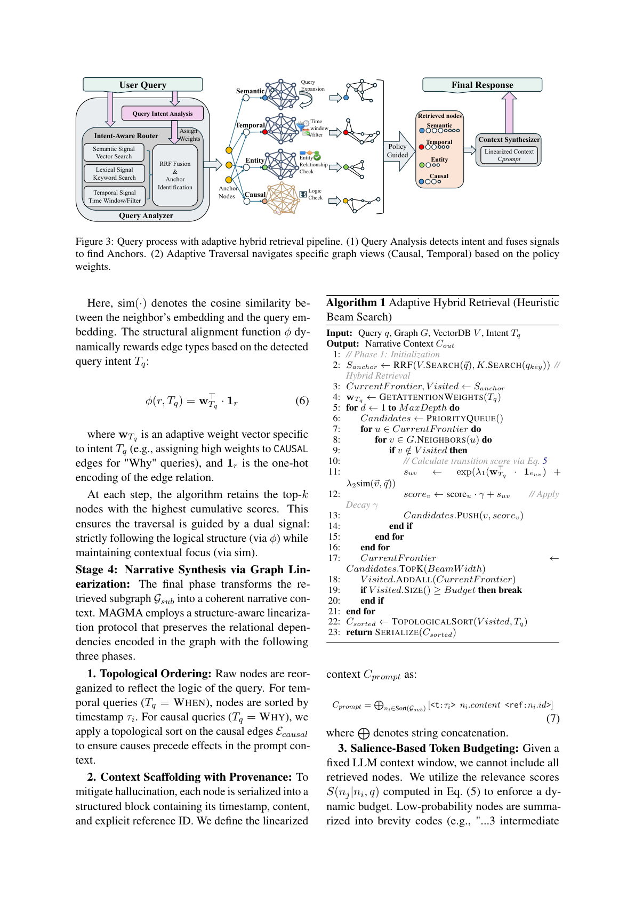

# MAGMA 系统架构

> 基于 [arXiv 2601.03236](https://arxiv.org/abs/2601.03236) 论文 Section 3.1-3.2

## 论文原图

### Figure 2: MAGMA 三层架构总览


> 三层设计：Query Process → Data Structure → Memory Evolution。数据层维护 VectorDB + GraphDB，演化层通过 Fast/Slow Path 持续巩固记忆结构。

```
┌──────────────────────────────────────────────────┐
│                 Application Layer (3.5)           │
│  FastAPI REST API  ·  MCP stdio server           │
│  /events  /query  /stats  /save  /load           │
├──────────────────────────────────────────────────┤
│              Query Process Layer (3.3)            │
│  ┌──────────┐  ┌────────┐  ┌───────────────┐    │
│  │ Intent   │→ │  RRF   │→ │ Beam Search   │→   │
│  │ Classify │  │ Fusion │  │ (Algorithm 1) │    │
│  └──────────┘  └────────┘  └───────────────┘    │
│                        ↓                          │
│              ┌────────────────┐                   │
│              │  Linearization │ (Algorithm 1)     │
│              └────────────────┘                   │
├──────────────────────────────────────────────────┤
│           Data Structure Layer (3.2)              │
│  ┌──────────────────────────────────────────┐    │
│  │              GraphDB                      │    │
│  │  ┌──────────┐  ┌──────────┐              │    │
│  │  │ Temporal │  │  Causal  │              │    │
│  │  │  Edges   │  │  Edges   │              │    │
│  │  └──────────┘  └──────────┘              │    │
│  │  ┌──────────┐  ┌──────────┐              │    │
│  │  │ Semantic │  │  Entity  │              │    │
│  │  │  Edges   │  │  Edges   │              │    │
│  │  └──────────┘  └──────────┘              │    │
│  └──────────────────────────────────────────┘    │
│  ┌──────────────────────────────────────────┐    │
│  │              VectorDB                     │    │
│  │  FAISS / NumPy  ·  cosine similarity     │    │
│  └──────────────────────────────────────────┘    │
├──────────────────────────────────────────────────┤
│          Memory Evolution Layer (3.4)             │
│  ┌──────────────────┐  ┌────────────────────┐    │
│  │   Fast Path      │  │    Slow Path        │    │
│  │ (Algorithm 2)    │→ │  (Algorithm 3)      │    │
│  │ Write → Embed    │  │  LLM → Causal/Entity│    │
│  │ → Store → Enqueue│  │  Background Worker  │    │
│  └──────────────────┘  └────────────────────┘    │
└──────────────────────────────────────────────────┘
```

## 数据模型（论文公式 3）

每个事件节点 `n_i` 由四元组定义：

```
n_i = <c_i, τ_i, v_i, A_i>

c_i  — 内容描述文本 (content_narrative)
τ_i  — 时间戳 (timestamp)
v_i  — 语义嵌入向量 (embedding_vector)
A_i  — 属性字典 (attributes)
```

**代码实现**：`memory/graph_db.py` → `EventNode` dataclass

## 四种关系边

| 边类型 | 方向 | 创建方式 | 子类型 |
|--------|------|----------|--------|
| **TEMPORAL** | 有向 | 自动（事件写入时） | PRECEDES / SUCCEEDS |
| **SEMANTIC** | 无向 | cos(v_i,v_j) > θ | SIMILAR_TO / RELATED_TO |
| **CAUSAL** | 有向 | LLM 慢路径推断 | LEADS_TO / BECAUSE_OF / ENABLES / PREVENTS |
| **ENTITY** | 有向 | LLM 实体提取 | REFERS_TO / MENTIONED_IN |

**代码实现**：`memory/graph_db.py` → `LinkType` / `LinkSubType` 枚举

## 四阶段查询流水线

### Figure 3: 查询流水线（论文原图）



> 四阶段：Intent Classification → RRF Multi-Signal Fusion → Adaptive Beam Search → Narrative Synthesis（Linearization）

### Stage 1: 意图分类

```
输入: 自然语言查询 q
输出: T_q ∈ {WHY, WHEN, WHAT, ENTITY}

分类器: 轻量级规则匹配（关键词 + 句式）
WHY:   "为什么" "原因" "为何"
WHEN:  "什么时候" "昨天" "上周"
WHAT:  默认
ENTITY: "关于谁" "涉及什么"
```

**代码**：`memory/query_engine.py` → `classify_intent()`

### Stage 2: RRF 多信号锚点定位

论文公式 (4):

```
S_anchor = Top_K( Σ 1/(k + r_m(n)) )

三条信号源：
1. 向量搜索 (semantic)
2. 关键词匹配 (lexical)
3. 时间窗口过滤 (temporal) [G5]
```

**代码**：`memory/query_engine.py` → `find_anchors()`

### Stage 3: 自适应 Beam Search 遍历

论文 Algorithm 1 + 公式 (5):

```
S(n_j|n_i,q) = exp(λ₁·φ(type(e_ij),T_q) + λ₂·sim(v_j,v_q))

φ(r, T_q) = w_Tq^T · 1_r    (公式 6)
```

意图权重决定边的遍历优先级：
- WHY: 因果边 ×3.0
- WHEN: 时间边 ×3.0
- WHAT: 语义边 ×2.0
- ENTITY: 实体边 ×3.0

**代码**：`memory/query_engine.py` → `adaptive_traversal()` + `_INTENT_WEIGHTS`

### Stage 4: 叙事合成（线性化）

论文公式 (7) + 三阶段：

1. **拓扑排序**：按意图类型排列（WHEN=时间序, WHY=因果序）
2. **上下文脚手架**：`<t:τ_i> content <ref:id>`
3. **显著性预算**：token 超限时截断尾部

**代码**：`memory/query_engine.py` → `linearize_context()`

## 快路径 vs 慢路径

| 维度 | 快路径 (Fast Path) | 慢路径 (Slow Path) |
|------|-------------------|-------------------|
| **论文** | Algorithm 2 | Algorithm 3 |
| **触发** | POST /events | 后台 Worker 消费队列 |
| **操作** | 创建节点 → 编码嵌入 → 存储 → 加时间边 → 入队 | 取 2-hop 子图 → LLM 推断 → 加因果/实体边 |
| **延迟** | <100ms | 5-60s（LLM API） |
| **依赖** | sentence-transformers | LLM API |

**代码**：`memory/trg_memory.py` → `add_event()` + `_consolidation_worker()`

## 文件对应表

| 文件 | 论文章节 | 职责 |
|------|:------:|------|
| `memory/graph_db.py` | 3.2 | 数据模型 + 四图存储 |
| `memory/vector_db.py` | 3.2 | 向量索引 + FAISS |
| `memory/trg_memory.py` | 3.2, 3.4 | 快/慢路径核心引擎 |
| `memory/query_engine.py` | 3.3 | 四阶段查询流水线 |
| `app.py` | 3.5 | FastAPI 应用层 |
| `mcp_magma_server.py` | — | MCP stdio 协议适配 |
